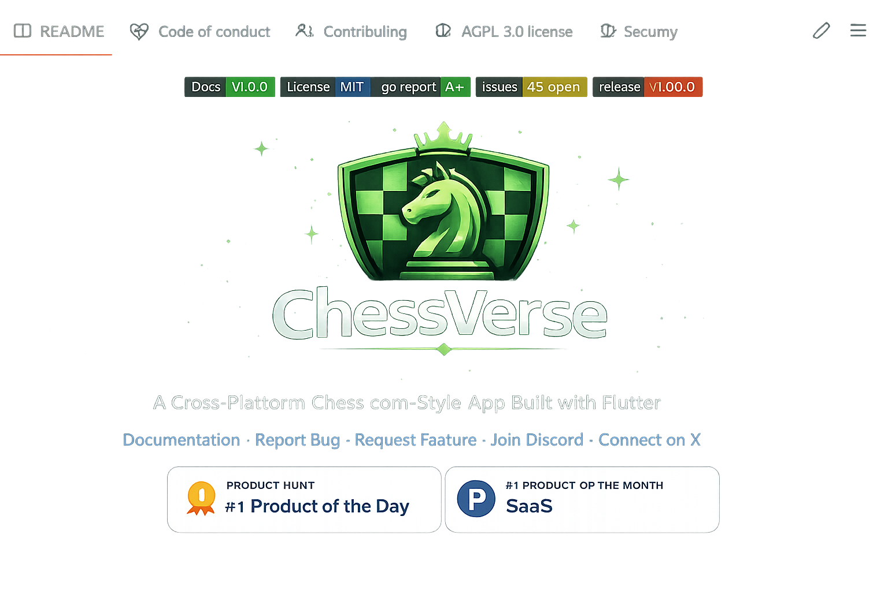

♟️ Chess-Verse

<p align="center">
  
</p>


A Cross-Platform Chess.com-Style App Built with Flutter

ChessVerse is a fully-featured, real-time multiplayer chess platform inspired by Chess.com, built using Flutter with a single codebase for Android, iOS, Windows, and macOS.

It supports online matchmaking, AI games, friend challenges, analysis tools, and a scalable backend architecture.

🚀 Features
🎮 Gameplay
Full chess rules engine (FIDE-compliant)

Legal move validation

Check, checkmate, stalemate detection

Castling, en passant, pawn promotion

Draw rules (threefold repetition, 50-move rule, insufficient material)

Move history (FEN & PGN support)

🌐 Game Modes
Online Multiplayer (real-time)

Play vs Computer (multiple difficulty levels)

Play with Friends (invite via link/code)

Offline Local Play

👥 Multiplayer & Social
Real-time matchmaking (Bullet, Blitz, Rapid, Custom)

ELO rating system

Spectator mode

In-game chat

Reconnection handling

🧠 Analysis & Learning
Game review after each match

Evaluation bar & best-move suggestions

Puzzle mode & daily challenges

🎨 UI / UX
Smooth animated chessboard

Legal move highlights

Timers with increments

Light & Dark themes

Mobile touch + Desktop mouse optimized UI

🖥️ Supported Platforms
Android
iOS
Windows
macOS
Built with Flutter — single codebase, native performance.

🧱 Tech Stack
Frontend
Flutter (Dart)

State Management: Bloc / Riverpod

Custom chessboard renderer

Platform-adaptive UI

Backend
WebSockets for real-time gameplay

REST APIs for authentication & profiles

Scalable matchmaking system

Secure game state synchronization

Chess Engine
Integrated Stockfish (or custom engine)

Configurable AI difficulty levels

Database
User profiles

Match history

Ratings & statistics

🔐 Authentication
Email & Password

Google Sign-In

Apple Sign-In (iOS/macOS)

⚙️ Installation & Setup
Prerequisites
Flutter SDK (latest stable)

Dart

Android Studio / Xcode (for mobile builds)

Clone the Repository
```
git clone https://github.com/your-username/chessverse.git

cd chessverse
```
Install Dependencies
```
flutter pub get
```
Run the App
```
flutter run
```
Build for Desktop

```
flutter build windows

flutter build macos
```